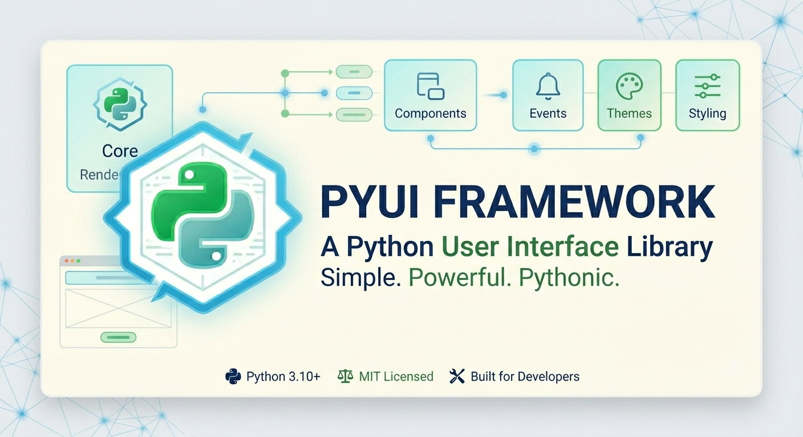
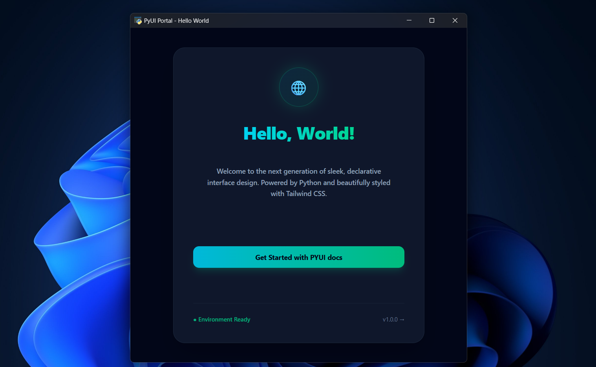

This project is targeted to make cross platform applications using python.PYUI is a layout pre-compiled framework for making python applications in very lightweight sizes. It uses a xml layouting system for defining layouts, python for logic and **PYWebview** as the renderer.Leading to a blank application size only 16MB compared to heavyweight rendering systems cosing 50+ MB or TKinter that has very legacy thread-unsafe architecture

**Note: Project is under rapid development and is in meta stable state. First stable release will be v1.0**

## Motivation
1.**Making General Purpose Applications:** This project is driven by the motivation of making a framework over python that can be used to make general purpose applications with little or no learning curve.

2.**Smaller learning curve:** Recent solutions for UI development mostly are hard to learn and manage. However we adopted age-old xml layouting system that makes defining UI easy for anyone with little xml/html knowlege. 

3.**Support of Python libaries and modules:** On the logic side python can use used to it's Limit, also the threadsafe nature of the framework helps in extreme scalability.

4.**Compiled Layout and Reusibility:** This framework has pre-compiled layouting system.So errors in layout are identified on runtime. Also Layout supports re-usibility using **PYUI Components**.

## Key Features of PYUI API
1. **DOM Manipulation:** One can change dom components from python side.There style,class,innertext and other attributes.

2. **PYUI Custom Syscalls:** Using this one can extend PYUI to support any JS libaries(chart.js and etc) by writing minimal Javascript.Or can use to commiunicate between JS ans Python runtime if needed without touching internal sockets.

3. **PYUI Hooks:** If some DOM updates are fast and can be lossy but realtime one can use PYUI Hooks.This can be mostly used to stream video or audio from Python to JS runtime

4. **Window Management:** A PYUI forms contain can contain more than one view(window) and **PYUI** provides apis to change windows dynamically. Also Exposes Webview object for *PYwebview* for changing the application window

5. **Forms Management:** **PYUI** provides dedicated apis to show and hide forms.

## Getting Started

### Installing PYUI 

PYUI has been tested only on Windows(x64) right now in v1.0 it will support both Windows and linux. However you can still use it in linux by building your own **PYUI** Package from source by compiling the xmlparser and changing few lines of code in *PYUI/compiler*.

1.Get the PYUI using 

    pip install pyui-desktop

### Setting up project

    mkdir HelloWorldApp
    
    python -m PYUI.create HelloWorldApp

**Note:** Replace your app name with 'HelloWorldApp' as per your choice

This will generate boilerplate project. Following folder and files will be generated in the given folder(i.e HelloWorldApp or your app name).

    layouts
    code
    layouts/JS
    layouts/styles
    code/index.py
    code/__init__.py
    layouts/index.xml
    settings.py

### Compiling project

Go to the project directory

    cd HelloWorldApp 

**Note:** Replace your app name with 'HelloWorldApp' and go to that directory

To compile to a PYUI project and run it

    python -m PYUI.manage --compile ./ --run

This command will compile your project into a PYUI project and run it. Within few seconds(depending on project size) you can see your project load in a while.

To compile without running project

    python -m PYUI.manage --compile ./

It will save your project in *build/temp_xxxxx.yyyy* (see last line of buildscript output). To launch the project go to the directory and run:

    python bootstrap.py

It will launch your UI

To compile to a executable

    python -m PYUI.manage --compileexe ./ --name HelloWorldApp

This command will make a *debug* folder go to that folder and run *HelloWorldApp.exe*

**Note:** Replace the 'HelloWorldApp' with your disired App Name

## Changing Layouts

TO change layouts open the *layouts/index.xml* and change the layout as per your needs.To start with a blank boilerplate, clear the content of the file and replace it with:

    <pyui>
        <metadata>
        <version>1.0.0</version>
        </metadata>
        <form-settings>
            <title>PyUI Portal - Hello World</title>
        </form-settings>
        <main-content default-active-window="boilderplateview">
            <window id="boilderplateview">
    
            </window>
        </main-content>
    </pyui>

[Refer to documentation for XML Tags](https://akalabayapal.github.io/PYUI-docs/PYUI%20XML%20LAYOUT%20GUIDE/important_tags/) for further references

**Note:** Documentation is yet not completed and is under development

### HotReloading Layouts

You can hot-reload the layout for faster UI development.

    python -m PYUI.manage --hotreload layouts/index.xml

**Note:** Replace with your file name

Changing the xml file will reload the UI automatically

If you are using styles from some folder that is not present in styles folder of the xml-file directory then

    python -m PYUI.manage --hotreload <layout-xml-file> --stylepath <custom-styles-folder>

   

**Note:** Use the *--keepontop* flag to keep the UI on top always

## Handling Logic using python

Open the *code/index.py* you will see

    from PYUI.Package.PYUI import PYUI

    def entry(obj:PYUI):
        pass

*entry* is the entry point to your code for handling *layouts/index.xml*.

### Simple PYUI References

1.Changing innertext for a component

    obj.settext('id','new-text')

Replace with the tag's id 

2.Getting a particular id's attribute

    obj.getAttrib('id','attribute-to-get')

3.Setting a particular id's attribute

    obj.set('id','attribute','new-value')

4.Set a new Style for a id

    obj.setStyle('id','attribute','value')

5.Add or Remove a Class

    obj.changeClass('id','class-name-to-be-added-removed',action)

**Action:** this can be ADD and REMOVE.

**Toggle is also taken but is yet to be implemented in 0.5.1**

6.Get classList for a id

    obj.getClassList('id')

7.Remove attribute

    obj.removeAttrib('id','attribute')

8.Register a callback to a id

    def callback_function(obj:PYUI,message:msg):
        
        #your logic goes here
        ....

    def entry(obj:PYUI):

        ....
        obj.RegisterCallback('id','typeOfCallback',callback_function)

**Note:** typeOfCallback is any valid callback supported by JS Dom like click,hover etc.

9.UnRegister a callback

    obj.UnRegistetCallBack('id','typeOfCallback')

10.End the form

    obj.End()

For further and more advanced features refer to our documentation.

## Making a new view/window

PYUI supports multiple view inside one form.To add a new view you need to add *window* tag with id inside *main-content* tag

    <main-content>
        <window id="window-1">
            ....
        </window>

        <window id="newly-added-window">
            ....
        </window>
    
    <main-content>

**Note:** PYUI layout only supports **"** and not **'**.Using a single quote may cause errors.

### Switching between views/Windows

You can dynamically switch between windows/views

    obj.changeWindow('id-of-window-to-be-displayed')

## Creating a new form

Forms are isolated windows inside a single app.Each forms are process level isolated from one another.

To make a new form

1.Add *newform.xml* in layouts folder

2.strictly put the same name *newform.py* in the code folder

3.Copy the boilerplates from above to start with

### Loading new forms dynamically

To load a form from python use:

    obj.loadForm('newform')

**Note:** Replace 'newform' with your form name accordingly

## Documentation

For further API references for XML and PYUI check the documentation.

Documentation: [PYUI Documentation](https://akalabayapal.github.io/PYUI-docs/)

**Note:** Documentation is yet not completed and is under development

## Changes and Contribution

Contribution in this project is open and highly welcomed.

## Credits

PyWebview: https://github.com/r0x0r/pywebview

